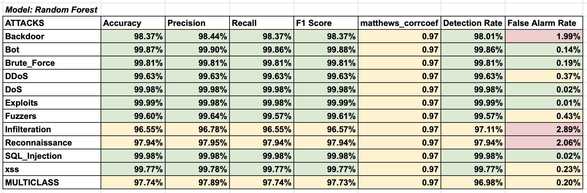
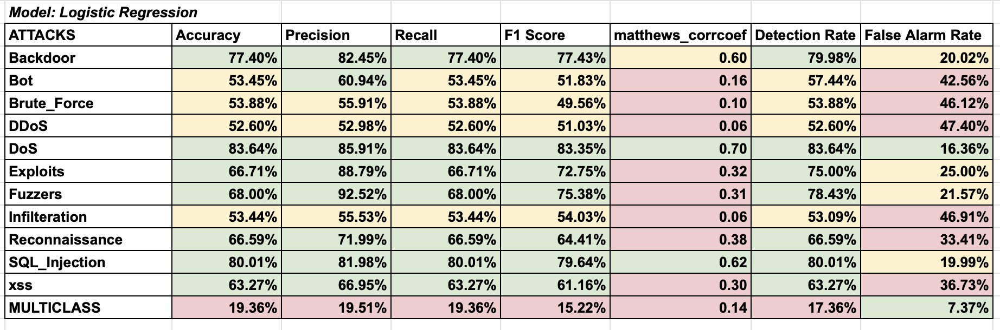
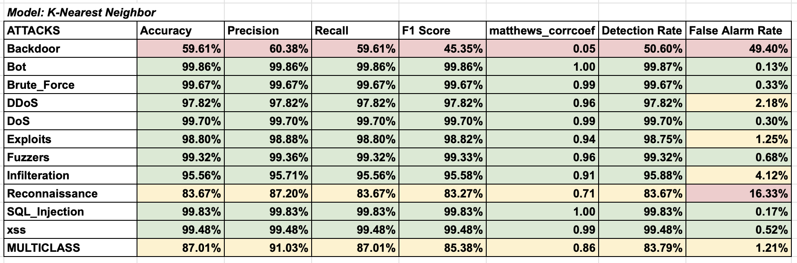

# Network-Intrusion-Detection-ML
Implemented this for the Machine Learning class project at SJSU, am uploading all relevant content here including midterm presentation, final report and case study.

# Results 

## Random Forest Model

## Logistic Regression Model

## KNN Model

## 📌 Project Overview
This project implements an automated Network Intrusion Detection System (NIDS) driven by supervised machine learning. The goal is to shift from static rule-matching to dynamic behavioral analysis, allowing for the detection of zero-day attacks and high-speed traffic anomalies without deep packet inspection (DPI).

We developed an end-to-end data science pipeline capable of classifying benign traffic and **11 specific attack classes** (including DDoS, Botnets, and Brute Force) using the **NetFlow v3** dataset.

## 📊 Dataset
We utilized the **NF-UNSW-NB15-v3** dataset, chosen for its robust flow-based features and representation of modern traffic.
* **Format:** NetFlow v3 (Flow-based analysis).
* **Attributes:** 53 features (43 attributes + 10 temporal features).
* **Preprocessing:** The pipeline handles infinite values, normalizes distributions, and removes "leaky" columns (e.g., source IP, destination ports) to prevent overfitting.

## 🛠️ Methodology
The project employs a modular feature engineering and training pipeline.

### 1. Feature Engineering
* **Leaky Column Removal:** Dropped identifiers like IP addresses and ports to prevent data leakage.
* **Correlation Pruning:** Removed columns with >95% covariance to reduce redundancy.
* **Balancing:** Capped records at 300k per category to handle class imbalance.

### 2. Models Trained
We evaluated three distinct supervised learning algorithms using **K-Fold Cross-Validation (5 splits)**:
1.  **Logistic Regression:** Baseline linear classifier (to test linear separability).
2.  **K-Nearest Neighbors (KNN):** Distance-based classifier.
3.  **Random Forest:** Ensemble method (Decision Trees).

## 📈 Key Results
The **Random Forest** model was the top performer, demonstrating the ability to capture complex, non-linear attack signatures with minimal false alarms.

| Model | Accuracy | F1-Score | False Alarm Rate (FAR) | Verdict |
| :--- | :--- | :--- | :--- | :--- |
| **Random Forest** | **97.74%** | **97.73%** | **0.20%** | **Best Performer** |
| **KNN** | 87.01% | 85.38% | 1.21% | Mid-Tier |
| **Logistic Regression** | 19.36% | 15.22% | 7.37% | Failed (Non-linear data) |

## 🚀 Usage

### Prerequisites
* Python 3.x
* Jupyter Notebook / Google Colab
* Libraries: `pandas`, `numpy`, `sklearn`, `matplotlib`, `seaborn`, `joblib`, `gdown`

### Running the Project
The entire pipeline is contained within `main.ipynb`.

1.  **Open the Notebook:** Open `main.ipynb` in Google Colab or a local Jupyter environment.
2.  **Install Dependencies:** Run the package installation cell (`!pip install -q gdown`).
3.  **Data Loading:** The notebook contains utility functions to automatically download the processed dataset from Google Drive.
4.  **Execute Pipeline:** You can run the "Feature Engineering" block to process raw data or skip to "Model Training" to load the pre-processed checkpoint.

## 📄 References
* *Temporal analysis of NetFlow datasets for network intrusion detection Systems* (Luay et al., 2025)
* *Towards a standard feature set for network intrusion detection system datasets* (Sarhan et al., 2021)
